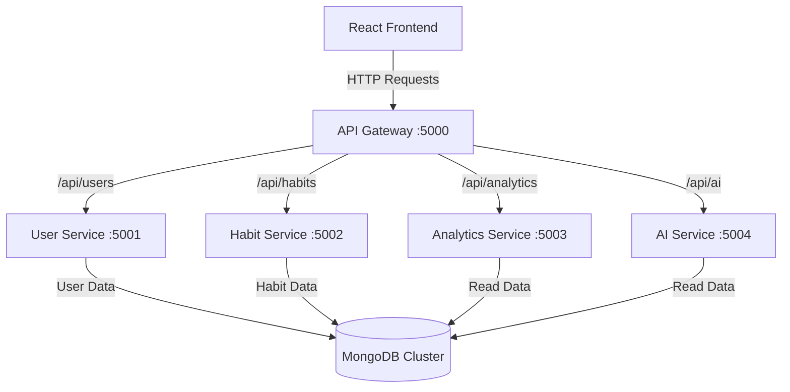

# Smart Habit & Focus Tracker with AI Insights

A modern full-stack microservices application for tracking habits and receiving AI-powered insights.

## Architecture



- **Frontend**: React + Vite + Tailwind CSS
- **API Gateway**: Express.js (Port 5000)
- **User Service**: Express.js + MongoDB (Port 5001)
- **Habit Service**: Express.js + MongoDB (Port 5002)
- **Analytics Service**: Express.js + MongoDB (Port 5003)
- **AI Insights Service**: Express.js (Port 5004)

## Prerequisites

- Node.js (v16+)
- MongoDB (local or Atlas)
- npm or yarn

## Setup Instructions

### 1. MongoDB Setup
Ensure MongoDB is running locally on `mongodb://localhost:27017` or update connection strings in service `.env` files.

### 2. Install Dependencies

```bash
# API Gateway
cd api-gateway
npm install

# User Service
cd ../user-service
npm install

# Habit Service
cd ../habit-service
npm install

# Analytics Service
cd ../analytics-service
npm install

# AI Insights Service
cd ../ai-service
npm install

# Frontend
cd ../frontend
npm install
```

### 3. Start Services

The fastest way to install dependencies and run all microservices simultaneously is by running the root start script (Windows):

```powershell
.\start.ps1
```

*(If you are on Linux/Mac or prefer manual startup, you will need to open 6 terminals and run `npm start` inside each microservice directory, and `npm run dev` in the frontend).*

### 4. Access Application

Open browser: `http://localhost:5173`

## Default Test Account

- Email: `test@example.com`
- Password: `password123`

## API Endpoints

### User Service (via Gateway)
- POST `/api/users/register`
- POST `/api/users/login`
- GET `/api/users/profile`

### Habit Service (via Gateway)
- POST `/api/habits` - Create habit
- GET `/api/habits` - Get all habits
- PUT `/api/habits/:id` - Update habit
- DELETE `/api/habits/:id` - Delete habit
- POST `/api/habits/:id/complete` - Mark complete

### Analytics Service (via Gateway)
- GET `/api/analytics/stats` - Get statistics
- GET `/api/analytics/weekly` - Weekly progress

### AI Insights Service (via Gateway)
- GET `/api/ai/insights` - Get AI suggestions

## Project Structure

```
smart-habit-tracker/
├── api-gateway/          # API Gateway
├── user-service/         # User authentication & profiles
├── habit-service/        # Habit CRUD & tracking
├── analytics-service/    # Statistics & charts
├── ai-service/          # AI insights generator
├── frontend/            # React frontend
└── README.md
```

## Features

✅ Microservices architecture
✅ JWT authentication
✅ Habit tracking with streaks
✅ Analytics dashboard
✅ AI-powered insights
✅ Responsive design
✅ MongoDB integration
✅ API Gateway pattern

## Technologies

**Frontend**: React, Vite, Tailwind CSS, Axios, Recharts
**Backend**: Node.js, Express.js, MongoDB, JWT, bcryptjs
**Architecture**: Microservices with API Gateway

## Troubleshooting

> [!WARNING]
> **503 Service Offline Error**: If the frontend displays network errors, ensure that `api-gateway` and the backing microservices have not crashed. Check the terminal outputs for the specific service.

> [!WARNING]
> **MongoDB Connection Refused**: Verify that MongoDB Community Server is installed and actively running as a background service on `localhost:27017`.

> [!TIP]
> **Seed Script Fails**: Make sure you run `npm run seed` inside `user-service` *before* running it in `habit-service`, since the default habits rely on the test user existing in the database first.
